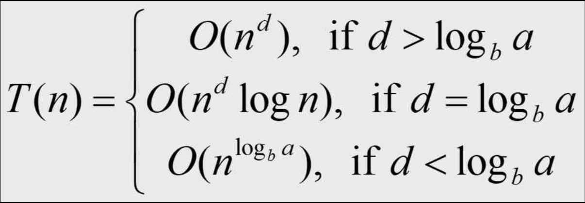

# Devide & Conquer

> 문제를 재귀적으로 분할하여 해를 구하고, 그 해들을 결합해서 원래 문제의 해를 구하는 알고리즘


1. Divide $g(n)$ : divide problem to subproblems
2. **Degenerate Case : 더 분할하지 않고 풀 수 있는 크기의 문제** 
3. Conquer : degenerate case로 부터 문제의 해를 구하는 과정 (b등분한 n개의 subproblems)
4. Combine $h(n)$ : 하위 sub-problem의 해로부터 상위 sub-problem의 해를 복구

$f(n) = a * f(n/b) + g(n) + h(n)$

## dummy divide & conquer

- dnc를 써서 기존의 알고리즘을 대체하는 알고리즘이지만, 성능 향상에는 도움이 되지 않음 dnc 개념을 이해하는 데는 도움을 줌
- 예) max, sum, tournament, …
- 최대값 구하기 (find_max) – dummy divide & conquer
- why Tournament is dummy dnc?
    
    이중 loop에서 구현된 tournament 알고리즘의 시간복잡도와 분할 정복으로 구현된 알고리즘의 시간복잡도와 상관이 없다.

# Divide & Conquer 

1. 결합이 필요한가?
2. Yes ⇒ 결합이 단단한가?
    1. No ⇒ centroid가 필요한가?
        1. Yes : Merge
        2. No : find_closest_pair, Histogram, Centroid of a tree
    2. Yes : find_max, sum


degenerate case ⇒ conquer
divide
combine

# Divide & Conquer Time Complexity

1. 분할 정복을 표현하는 식
    
    $f(n) = a * f(n/b) + g(n) + h(n)$
    
2. 분할 정복의 식은 점화식으로 표현
    
    $T(n) = a * T(\frac{n}{b}) + O(n^d)$
    
    1. 마스터 정리 (master theorem)



# DNC Implementaion

- degenerate case → conaure

- divide

- combine


## (1) Binary Search

- a = 1, b = 2, d = 1

$T(n) = 1 * T(\frac{n}{2}) + O(1)$

```c++
int *arr;

int binary_search_dnc (int s, int e, int key) // T(n)
{
    /* 1. degenerate case -> conquer */
    if (s == e)
        return (arr[s] == key) ? s : -1; // O(1)

    /* 2. divide */
    int m = (s + e) / 2;
    if (key == arr[m])
        return m;
    else if (key < arr[m])   // T(n/2)
        return binary_search_dnc(s, m - 1, key);
    else
        return binary_search_dnc(m + 1, e, key); 

    /* 3. combine */
}
```

## (2) Merge Sort

1. n개의 원소를 가진 배열 1개 ⇒ 1개의 원소를 가진 정렬된 배열 n개
2. 2개의 원소를 가진 정렬된 배열 n/2 개
    
### $T(n) = 2 * T(\frac{n}{2}) + O(n)$
    
```c++
int *arr;

int msort (int s, int e) /* s = 0, e = n-1 */ // T(n)
{
    /* 1. degenerate case -> conquer */
    **if (s == e) // O(1)
        return;**

    /* 2. divide */
    int m = (s + e) / 2; // T(n/2)
    msort(s, m);
    msort(m + 1, e);

    /* 3. combine */
    merge(s, m, m + 1, e); // O(n)
}
```
    

## (3) Quick Sort

### $T(n) = T(k) + T(n - k - 1) + O(n)$

Merger vs Quick : Quick (Degenerate case를 늦게 만날 수 있다 $O(n^2)$. - worst case)

```c++
int *arr;

void qsort(int s, int e) // T(n)
{
    /* 1. degenerate case -> conquer */
    if (s >= e) // O(1)
        return;

    /* 2. divide */
    int m = split(s, e); // O(n)
    qsort(s, m - 1);
    qsort(m + 1, e);

    /* 3. combine */
}
```

## (4) Select-kth (중간값 선택)

early-stop 가능

```c++
int select_kth ( int k, int s, int e ) // T(n)
{
    /* 1. degenerate case → conquer */
    if ( s == e )
        return arr[s];
    /* 2. divide */
    int m = split ( s, e ); // O(n)
    if ( k == m )
        return arr[k];
    if ( k < m )
        return select_kth ( k, s, m - 1 ); // T(k)
    else if ( k > m )
        return select_kth ( k-m, m + 1, e ); // T(n - k - 1)

    /* 3. combine */
}
```

# Divide & Conquer 알고리즘의 종류

## Search

- binary search
- Select-kth
- Median of medians

## Sorting

- Merge Sort
- Quick Sort

## Fourier transform

- FFT algorithm
- DFT algorithm

## Multiplication

- Integer multiplication (Karatsuba)
- Matrix multiplication (Strassen)
- Polynomial multiplication (Karatsuba)

## Number theory

- Integer exponentiation by squaring
- Computing large Fibonacci numbers

## Computational geometry

- Closest pair of points
- Convex hull
- Line segment intersection
- Voronoi diagram
- Convex polygon
- Polygon triangulation
- Finding the smallest enclosing circle

## Dynamic programming

- Optimal binary search tree
- Matrix chain multiplication
- RNA secondary structure prediction
- Global alignment in sequence alignment
- Maximum subarray problem
- Finding maximum and minimum

## Data structure

- Graph
    - All-pairs shortest path
- Tree
    - Centroid
    - Binary search tree
    - Balanced binary search tree

## 기타

- Counting inversion
- Tiling problem
- Peak finding algorithm
- Parallel prefix sum algorithm