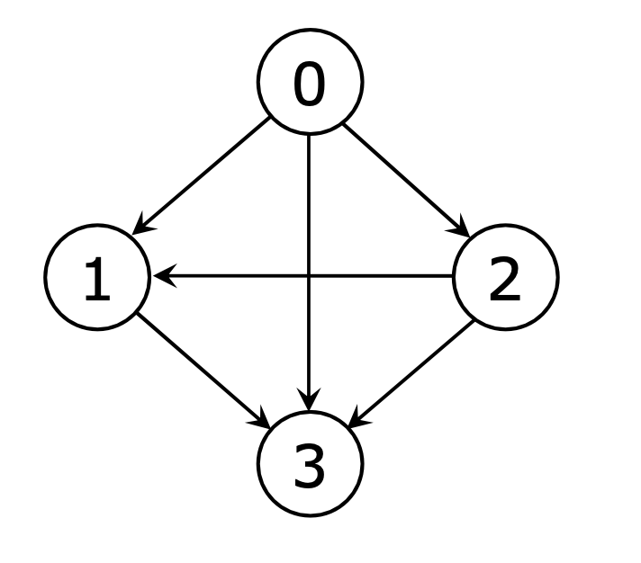

# Graph
- vertex와 edge로 구성된 자료구조이며, vertex는 정점, edge는 정점과 정점을 연결하는 간선을 의미한다.

## Graph 관련 용어
- Vertex (or Node) : 정점
- Edge : 간선
- Degree (차수) : 노드에 연결된 간선의 개수
    - in-degree(집입 차수) + out-degree(진출 차수)
- Adjacent Vertex : 인접 정점, 간선에 의해 직접 연결된 정점
- Incident : 연결된 Node와 Edge의 관계
- Path : 경로 (A→B 가는 방법)

## Graph 기본 개념
- 무방향(undirected) 그래프 vs 방향(directed) 그래프
    - 
- 가중치(weighted) 그래프
    - 각 edge에 특정 가중치가 부여된 그래프

- 연결 (Connected) 그래프
    - 모든 두 노드 사이에 경로가 존재하는 그래프

- 비연결 (Disconnected) 그래프
    - 일부 두 노드 사이에서 경로가 존재하지 않는 그래프

- 사이클 (Cycle) 그래프
    - 시작 노드와 끝 노드가 동일한 경로를 포함하는 그래프

- 비순환 (non-Cycle) 그래프
    - 싸이클이 없는 그래프

- sparse graph (희소 그래프)
    - 모든 vertex가 상수 개의 edge만 갖는 그래프
    - m = O(n)

- complete graph (완전 그래프)
    - 모든 vertex들 간에 edge가 존재하는 그래프
    - m = n(n – 1) ß directed graph
    - m = n(n – 1)/2 ß undirected graph

- dense graph (밀집 그래프)
    - 대부분의 vertex들 간에 edge가 존재하는 그래프
    - m = O(n^2)

- Spanning Tree
    - non-Cycle
    - Cycle이 없는 subgraph로, n개의 vertex를 가진 그래프에서 모든 vertex를 n–1개의 edge로 연결

- Minimum Spanning Tree (MST)
    - Spanning Tree중 전체 가중치의 합이 최소인 트리

## Graph의 표현

### 입력
1. edge list
    텍스트 파일로 표현 가능 (코테에서 애용하는 형태)
    n: vertex의 개수
    m: 간선의 개수
    (a,b): 간선 표현
    ```text
    4
    5
    1,2
    3,2
    4,1
    4,3
    2,4
    ```
2. map graph
    - width x height 크기의 map으로 표현된 그래프
    - vertex와 edge에 대한 명확한 표현이 없음

    ||||
    |---|---|---|
    |0|1|1|
    |0|1|0|
    |1|0|0|

### 표현
1. Adjacency matrix
    
    **graph[4][4]**


    
|||||
|---|---|---|---|
|0|1|1|1|
|0|0|0|1|
|0|1|0|1|
|0|0|0|0|

2. Adjacency list 

```text
0 -> 1 -> 2 -> 3
1 -> 3
2 -> 1 -> 3
3
```

## traversal

- 그래프의 모든 노드를 방문한다는 뜻