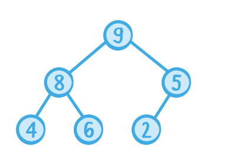

# Heap
> 트리 구조의 한 종류로, 부모 노드는 자식 노드를 0,1,2 개 가질 수 있으며 자기 자신이 가진 값보다 작아야 한다. 항상 최소 층(레벨)을 가진다.

# Heap Operations

## Remove Node
1. 대상 노드를 가장 마지막에 들어온 자식과 교환(swap)한다.
2. 가장자리 노드가된 대상 노드를 삭제한다. (removeLast())
3. 교환된 가장자리 노드는 아래 자식 중, 본인보다 큰 자식 노드가 있다면 비교를 통해 가장 큰 자식 노드와 교환한다.
4. 자식보다 큰 노드임을 만족할 때까지 반복한다.

## Add New Node
1. 가장자리에 새 노드를 추가한다.
2. 부모 노드와 비교하여, 추가된 자식 노드가 더 크다면 교환한다.

# Implementation

- 구현은 Tree가 아닌 Array로 구현한다.
- 자식 노드와 부모 노드간의 인덱스 값에는 규칙이 존재하기 때문에 가능하다.

출처 : https://www.kodeco.com/586-swift-algorithm-club-heap-and-priority-queue-data-structure